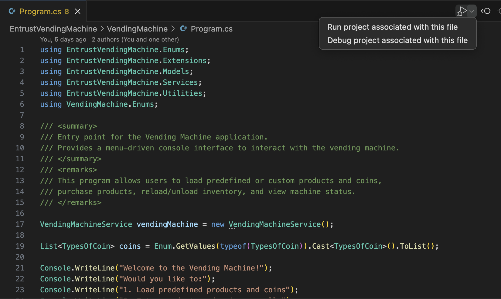
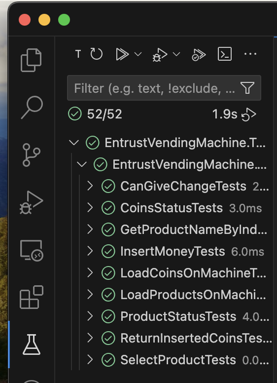

# Vending Machine Challenge

This project is a fully functional vending machine simulation developed in **C#** as part of the **Entrust Coding Challenge**. Designed with an emphasis on user interaction, accurate functionality, and clean code, it replicates the core operations of a real vending machine, including product inventory management, payment handling, and change distribution.

---

## Features

### Product Management
- Load products into the machine with prices and stock levels.
- Update inventory dynamically by adding or removing products.
- Display the full list of available products and their quantities.

### Payment Handling
- Accept user input to insert coins and process transactions.
- Accurately calculate and dispense change for overpayments.
- Gracefully handle errors like insufficient funds or invalid coin inputs.

### Inventory & Funds Management
- Maintain a real-time record of the total product value and available coins.
- Adjust stock and funds automatically after purchases or restocking.

### Error Handling
- Manage edge cases such as:
  - Products being out of stock.
  - The inability to provide exact change.
  - Invalid selections or unsupported coin denominations.

### Comprehensive Unit Testing
- Developed with **NUnit** to ensure robust code coverage.
- Includes tests for:
  - Product management.
  - Payment scenarios.
  - Edge cases like incorrect inputs and boundary conditions.

---

## Technologies Used
- **Language**: C#
- **Framework**: .NET
- **Testing Framework**: NUnit

---

## **Prerequisites**
  - **.NET 8.0**: Ensure that .NET 8.0 SDK is installed on your machine.  
  [Download here](https://dotnet.microsoft.com/download/dotnet/8.0).  
  - **IDE of Your Choice**: I used **VS Code**, but Visual Studio or any IDE that supports .NET development can be used.  
    - For VS Code, ensure the following extensions are installed:  
    - [C# Extension](https://marketplace.visualstudio.com/items?itemName=ms-dotnettools.csharp).  
    - [Test Explorer](https://marketplace.visualstudio.com/items?itemName=ms-dotnettools.test-explorer).

## How to Run the Application

1. Clone the repository:
   ```bash
   git clone https://github.com/your-username/EntrustVendingMachine.git
   cd EntrustVendingMachine
   ```

2. **Open the solution**:  
   - Launch the project in Visual Studio or your preferred IDE.

3. **Build and run**:  
   - **If using Visual Studio**:  
     - Set the startup project to `VendingMachineSimulator`.  
     - Right-click on the solution named `EntrustVendingMachine`, select **Set as Startup Project**, and press `F5` or click **Run**.  
  
   - **If using VS Code (as I did)**:  
     - Open the `Program.cs` file.  
     - Click the **Run** button in the top-right corner of the editor.
     

4. **Run tests**:
   - **If using Visual Studio**:  
     - Set the startup project to `EntrustVendingMachine.Testers`.  
     - Right-click on the solution named `EntrustVendingMachine.Testers`, select **Set as Startup Project**, and run the tests using the **Test Explorer**.  

   - **If using VS Code**:  
     - Open the **Testing** tab.  
     - Run the tests directly from there.
     

---

## Project Highlights

- **Realistic User Interaction**: Simulates a real-world vending machine experience with intuitive inputs and outputs.  
- **Scalable Design**: Built with modularity in mind, making it easy to extend or customize.  
- **Thorough Testing**: High-quality unit tests ensure reliability under various conditions and scenarios.  

---

## Contributing

Contributions are welcome! Whether you're fixing a bug, improving documentation, or adding new features, feel free to fork the repository, make changes, and submit a pull request.

---

## License

This project is distributed under the **MIT License**, giving you the freedom to use, modify, and distribute it as needed.

---

## Acknowledgments

This simulation was developed as part of the **Entrust Coding Challenge**. If you have feedback or questions, feel free to reach out or submit an issue in the repository.
